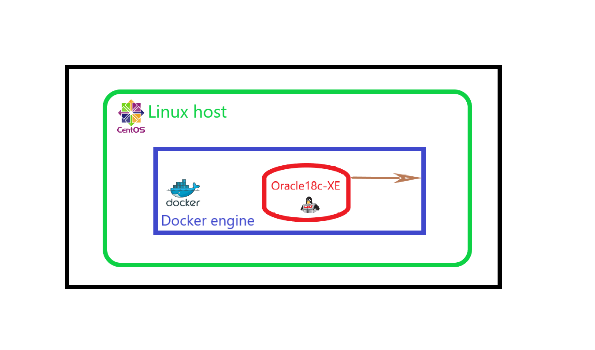

[![][license img]][license]


# Oracle18c-XE para OracleLinux7 en Docker

## Tabla de Contenido
- [I. Objetivo](#i-objetivo)
- [II. Requisitos](#ii-requisitos)
- [III. Consideraciones y Pre-Configuración](#iii-consideraciones-y-pre-configuración)
- [IV. Procedimiento](#iv-procedimiento)
- [V. Referencias](#v-referencias)


## I. Objetivo
Montar una Base de Datos Oracle18c XE en un Contenedor Oracle-Linux7


## II. Requisitos
1. Tener instalado [Linux Centos7][centos7] en una máquina virtual.
2. Tener instalado [Docker-CE][docker] en la MV Linux Centos7.
3. Tener instalado Git.
      ```
      $ su -
      $ yum install git
      ```
4. Haber descargado el archivo de instalación en format RPM [oracle-database-xe-18c-1.0-1.x86_64.rpm][oracle].
5. Espacio de almacenamiento requerido
      - 5.1- Al menos 15GB (Oracle recomienda 7680 MB) de espacio libre en **/opt** ; esta carpeta se ubica en el root folder **`/`** en la instalación    por defecto de Linux Centos7.
      - 5.2- Un Virtaul Disk de 20GB en el punto de montaje **/docker** ; montarlo después de haber instalado Linux Centos7 para evitar confusión.
6. RAM de la Máquina Virtual Linux Centos7 con 4GB.   

## III. Consideraciones y Pre-Configuración
1. Tu máquina virtual Linux Centos7 es considerada la máquina host para efectos de esta guía.
2. Tu usuario Linux Centos 7 es el que se utiliza por defecto en esta guía a menos que se indique lo contrario.
3. Desactiva el firewall en Linux Centos 7.
      ```
      $ systemctl stop firewalld
      $ systemctl disable firewalld
      ```
4. Cambiar permisos a la carpeta **/docker**
      ```
      $ su -
      $ chmod 777 /docker
      ```
5. Crea las siguientes carpetas dentro de **/docker**
      ```
      $ cd /docker
      $ mkdir oracle_product
      $ mkdir ./oracle_product/18cxe
      $ mkdir ./oracle_product/18cxe/oradata
      ```
6. La carpeta de trabajo por defecto es /docker/oracle_product para efectos de esta guía.

## IV. Procedimiento
1. Decargas
      - 1.1. Descargar de github este proyecto. Este va a crear una carpeta **docker-oracle-xe18c**
      ```
            $ cd /docker/oracle_product
            $ git clone https://github.com/jmedinaJBM/docker-oracle-xe18c.git
      ```
      - 2.2. Descargar imagen base de **Oracle-Linux7**
      ```
            $ docker pull oraclelinux:7.6
      ```
2. Crear imagen **oracledb/base-linux7:18cXE** con la Imagen base **oraclelinux:7.6**
      - 2.1. Crear el Dockerfile a partir del archivo **Dockerfile-1.txt**
      ```
            $ cd /docker/oracle_product
            $ cp ./docker-oracle-xe18c/Dockerfile-1.txt ./Dockerfile
      ```
      - 2.2. Construir la imagen **oracledb/base-linux7:18cXE**
      ```
            $ su -
            $ docker build --tag oracledb/base-linux7:18cXE ./
      ```
3. Crear el contenedor **oracledb-base** a partir de la imagen creada antes **oracledb/base-linux7:18cXE**
      ```
      $ docker run --name=oracledb-base -v /docker/oracle_product:/oracle_product -v /docker/oracle_product/18cxe/oradata:/opt/oracle/oradata -it -d oracledb/base-linux7:18cXE /bin/bash
      ```
4. Copiar el archivo RPM (**oracle-database-xe-18c-1.0-1.x86_64.rpm**) en la carpeta del host **/docker/oracle_product**
5. Instalación del Software
      - 5.1. Entrar al contenedor **oracledb-base**
      ```
            $ docker exec -it oracledb-base /bin/bash
      ```
      - 5.2. Comprueba variables de Ambiente y verifica la respuesta contra el archivo ***Dockerfile-1.txt***
      ```
            $ echo ${ORACLE_DOCKER_INSTALL}
            $ echo ${ORACLE_HOME}
            $ echo ${ORACLE_BASE}
      ```
      - 5.3. Cambiarse a la carpeta **oracle_product**
      ```
            $ cd /oracle_product
      ```
      - 5.4. Ejecutar Instalación
           * 5.4.1. Insttalar **oracle-database-preinstall-18c**
           ```
           $ yum install -y oracle-database-preinstall-18c
                  failed to link /usr/share/man/man1/ksh.1.gz -> /etc/alternatives/ksh-man: No such file or directory
                  Complete! 
           ```
           * 5.4.2. Cambiar permisos a la carpeta **opt/oracle**
           ```
           $ chown oracle:oinstall /opt/oracle
           $ chown oracle:oinstall /opt/oracle/oradata
           ```
           * 5.4.3. Instalar **oracle-database-xe-18c-1.0-1.x86_64.rpm**
           ```
            $ yum localinstall -y oracle-database-xe-18c-1.0-1.x86_64.rpm
                  [INFO] Executing post installation scripts...
                  [INFO] Oracle home installed successfully and ready to be configured.
                        To configure Oracle Database XE, optionally modify the parameters 
                        in '/etc/sysconfig/oracle-xe-18c.conf' and then execute '/etc/init.d/oracle-xe-18c configure' as root.
                  Installed:
                  oracle-database-xe-18c.x86_64 0:1.0-1 
                  Dependency Installed:
                  file.x86_64 0:5.11-35.el7
                  Complete!
            ```
6. Crear una imagen **oracledb/software-linux7:18cXE** a partir del contenedor **oracledb-base**. Esta imagen es un respaldo antes de configurar la instancia de la Base de Datos.
      ```
      $ docker stop oracledb-base
      $ docker commit -a "Jairo Medina <medina.jairo.b@gmail.com>" oracledb-base oracledb/software-linux7:18cXE
      ```
7. Configuración de la Instancia de Base de Datos.
      - 7.1. Iniciar el contenedor **oracledb-base**
      ```
            $ docker start oracledb-base
      ```
      - 7.2. Entrar al contenedor
      ```
            $ docker exec -it oracledb-base /bin/bash
      ```
      - 7.3. Ejecutar
      ```
            $ /etc/init.d/oracle-xe-18c configure
            
            Configuring Oracle Listener.
            Listener configuration succeeded.
            Configuring Oracle Database XE.
            
            100% complete
            Database creation complete. For details check the logfiles at:
            /opt/oracle/cfgtoollogs/dbca/XE.
            Database Information:
            Global Database Name:XE
            System Identifier(SID):XE
            Look at the log file "/opt/oracle/cfgtoollogs/dbca/XE/XE.log" for further details.
            
            Connect to Oracle Database using one of the connect strings:
            Pluggable database: 1219a23a0c49/XEPDB1
            Multitenant container database: 1219a23a0c49
            Use https://localhost:5500/em to access Oracle Enterprise Manager for Oracle Database XE
      ```
      - 7.4. Tareas de Post-Instalación
          * 7.4.1. Cambiar la clave del usuario oracle del contenedor.
            ```
                  $ passwd oracle
            ```
          * 7.4.2. Establecer la clave del usuario sys y system.
          ```
                  $ docker exec -it -u oracle oracledb-base /bin/bash
                  $ cd $ORACLE_HOME/bin
                  $ ./sqlplus sys as sysdba
                        SQL> startup
                        SQL> ALTER USER sys IDENTIFIED BY Pa$$w0rd;
                        SQL> ALTER USER system IDENTIFIED BY Pa$$word;
          ```
          * 7.4.3. Activar Acceso remoto. (con la misma sesion anterior)
          ```
                        SQL> exec dbms_xdb_config.setlistenerlocalaccess(false);
                        SQL> exec dbms_xdb_config.setglobalportenabled(true);
                        SQL> shutdown
                        SQL> exit;
          ```

8. Crear imagen definitiva
      - 8.1. Iniciar el contenedor y crear la carpeta **$ORACLE_BASE/scripts**
      ```
            $ docker start oracledb-base
            $ docker exec -it oracledb-base /bin/bash
            $ cd $ORACLE_BASE
            $ mkdir scripts
            $ chown oracle:oinstall scripts
            $ exit
      ```
      - 8.2. Crear una imagen **oracledb/temp-linux7:18cXE** a partir del contenedor **oracledb-base**. Esta imagen contiene la instancia de la Base de Datos Oracle 18c XE configurada.
           * 8.2.1. Detener la instancia Oracle y el contenedor
           ```
                  $ docker exec -it /oracledb-base /bin/bash
                  $ /etc/init.d/oracle-xe-18c stop
                  $ exit
                  $ docker stop oracledb-base
           ```
           * 8.2.2 Crear la imagen
           ```
                  $ docker commit -a "Jairo Medina <medina.jairo.b@gmail.com>" oracledb-base oracledb/temp-linux7:18cXE
           ```
     - 8.3. Crear carpeta **/docker/oracle_product/scripts**
     ```
            $ mkdir /docker/oracle_product/scripts
     ```
     - 8.4. Copiar archivos scripts dentro **/docker/oracle_product/scripts**
     ```
            $ cd /docker/oracle_product
            $ cp ./docker-oracle-xe18c/scripts/* ./scripts/
     ```
     - 8.5. Crear el **Dockerfile** a partir del archivo **Dockerfile-2.txt**
     ```
            $ cd /docker/oracle_product
            $ cp ./docker-oracle-xe18c/Dockerfile-2.txt ./Dockerfile
     ```
     - 8.6. Construir la imagen definitiva **oracledb/linux7:18cXE**
     ```
            $ su -
            $ cd /docker/oracle_product
            $ docker build --tag oracledb/linux7:18cXE ./
     ```
9. Crear contenedor **oracledb-18cxe** a partir de la imagen definitiva **oracledb/linux7:18cXE**
```
$ docker run --name=oracledb-18cxe -h oracle18cxe -p 5500:5500 -p 1521:1521 -v /docker/oracle_product/18cxe/oradata:/opt/oracle/oradata -d oracledb/linux7:18cXE 
```
10. Tareas de Post-Creación del contenedor
      - 10.1. Configuracion del Listener
            Es probable que los archivos **listener.ora** y **tnsnames.ora** no tenga el nombre de host correcto.
           * 10.1.1. Conectar con el contenedor
           ````
                  $ docker exec -it oracledb-18cxe /bin/bash
           ````
           * 10.1.2. Identificar el nombre del host
           ```
                  $ /bin/hostname
           ```
           * 10.1.3. Revisa los archivos **listener.ora** y **tnsnames.ora** en **$ORACLE_HOME/network/admin**
           ```
                  $ cd $ORACLE_HOME/network/admin
                  $ more listener.ora
                  $ more tnsnames.ora
           ```
           * 10.1.4. Modifica los archivos **listener.ora** y **tnsnames.ora** si el ***hostname*** no coincide.
           ```
                  $ su oracle
                  $ vi listener.ora
                  $ vi tnsnames.ora
                  $ exit
           ```
           * 10.1.5. Reinicia la base de datos
           ```
                  $ /etc/init.d/oracle-xe-18c restart
           ```
## V. Referencias
- [How to install Oracle Database 18c XE on Linux](https://geraldonit.com/2018/10/23/how-to-install-oracle-database-18c-xe-on-linux/)
- [Oracle Database 18c Express Edition (XE) RPM Installation On Oracle Linux 6 (OL6) and 7 (OL7)](https://oracle-base.com/articles/18c/oracle-db-18c-xe-rpm-installation-on-oracle-linux-6-and-7)
- [Oracle Database XE Downloads](https://www.oracle.com/technetwork/database/database-technologies/express-edition/downloads/index.html)
- [Docker build for Oracle Database Express Edition (XE)](https://github.com/fuzziebrain/docker-oracle-xe)

[license img]:https://img.shields.io/badge/License-MIT-green.svg
[license]:https://github.com/jmedinaJBM/docker-oracle-xe18c/images/LICENSE
[centos7]:https://www.centos.org/download
[docker]:https://docs.docker.com/install/linux/docker-ce/centos
[oracle]:https://www.oracle.com/technetwork/database/database-technologies/express-edition/downloads/index.html
